
    前言 

&nbsp;&nbsp;&nbsp;&nbsp;&nbsp;&nbsp;&nbsp;&nbsp;这一作的氛围比较轻松愉快，没有什么刀子或者让人胃疼的剧情，游戏全程基本上可以笑着玩。如果看哭了那也只会是因为看到了暖心的画面。另外我感觉本作在画质，UI方面相较前作有了比较大的进步。各方面均是上乘，实在挑不出什么毛病。实属充满诚意的佳作。

&nbsp;&nbsp;&nbsp;&nbsp;&nbsp;&nbsp;&nbsp;&nbsp;PS：不建议做单线战士，因为整个故事的剧情量还挺大的，而且很多地方经过精心设计，玩通关后才会知道那些看似不相关的各种要素是怎么联系到一起的。要是只玩其中几条线都不能体验到故事的全部魅力。也不建议看剧透，会降低游玩过程中的探索感。

来点BGM👇。

    <audio controls>
        <source src="https://vgmtreasurechest.com/soundtracks/senren-banka/bfxntkluzu/3-11%20Two%20Silhouettes%20%28Karaoke%20Version%29.mp3">
        Your browser does not support the audio element.
    </audio>

---

    背景&设定 

&nbsp;&nbsp;&nbsp;&nbsp;&nbsp;&nbsp;&nbsp;&nbsp;故事发生在一个名叫穗织的偏僻小镇，它被群山和大自然环抱。这里因为诅咒的原因而与世隔绝，周围的人都不愿意来，但也孕育了自己独特的文化。即使是在21世纪，这片土地上仍然有着神刀，诅咒，忍者等各种稀奇元素，所以吸引了大量的外国游客。游戏中对于这些元素处理的比较到位，既保持一定神秘气息又不故弄玄虚，还融入了许多生活气息，让人感觉这个小镇好像真的存在一样。

&nbsp;&nbsp;&nbsp;&nbsp;&nbsp;&nbsp;&nbsp;&nbsp;这片土地上的人们世世代代与诅咒对抗，似乎早已习惯了这种生活。直到有一天男主到来，并意外拔出了镇上的神刀，随后一切开始发生了改变。除了这次拔刀外，故事中还有其它很多地方看似也都充满了偶然性。但当全线通关后回过头来看，又能发现所有这些偶然背后似乎又都藏着某种必然，仿佛一切像是命中注定的。这种想法让我觉得非常浪漫。

&nbsp;&nbsp;&nbsp;&nbsp;&nbsp;&nbsp;&nbsp;&nbsp;故事的主线就是围绕对抗诅咒展开，随着剧情推进我们会一点点揭开诅咒的真面目，并对这片土地有更多的了解。为了避免剧透这里就不做过多的解释了。

---

    角色&各路线体验 

## 丛雨

  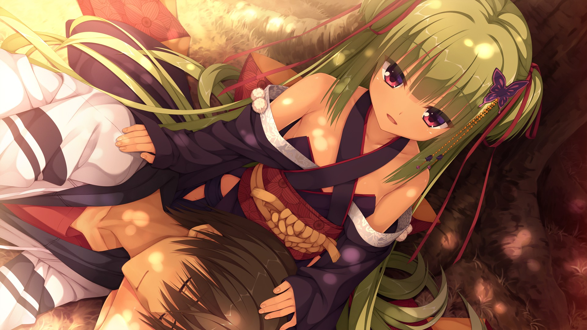
&nbsp;&nbsp;&nbsp;&nbsp;&nbsp;&nbsp;&nbsp;&nbsp;丛雨是神刀丛雨丸的守护者，总是与男主并肩作战。她在游戏中与男主的互动非常有趣，他们之间的关系进展也并不勉强或仓促。本路线中深入探讨了她的过去和个人挣扎，个人认为是最感人的路线。 
&nbsp;&nbsp;&nbsp;&nbsp;&nbsp;&nbsp;&nbsp;&nbsp;由于这条线对主线涉及的不多（基本上只是额外补充了一些丛雨的背景介绍），所以有了更多的时间留给二人的日常互动，保证可以让人看到爽。

&nbsp;&nbsp;&nbsp;&nbsp;&nbsp;&nbsp;&nbsp;&nbsp;另一个让我印象深刻的地方是男主在这条路线上的性格发展（他在丛雨线上的发展可能比其他所有路线的总和还要多），在路线的开头，男主还是和游戏开始时一样缺乏安全感和半吊子，但是当我们到达游戏的结尾时，他已经变得相当自信和可靠了。 
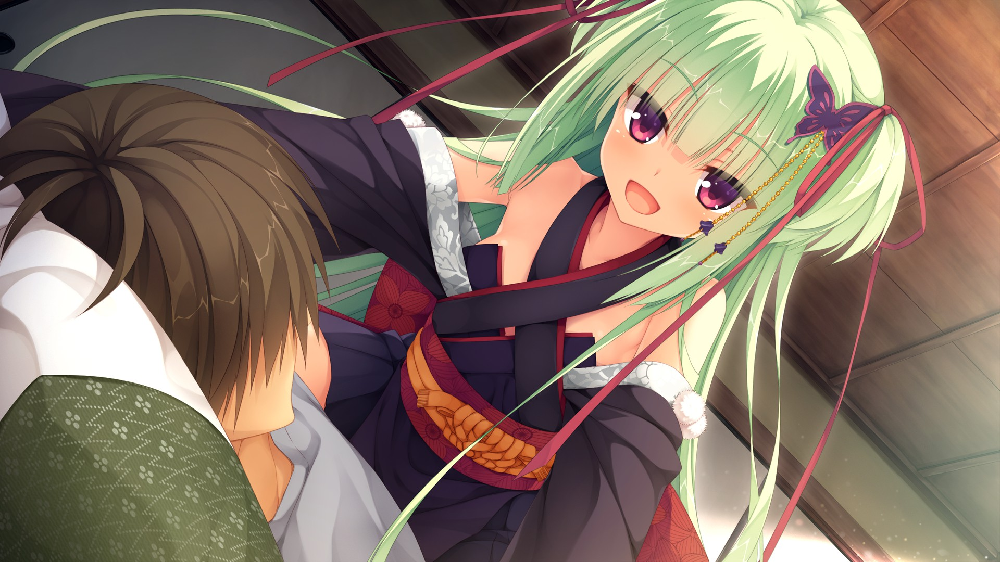

 

    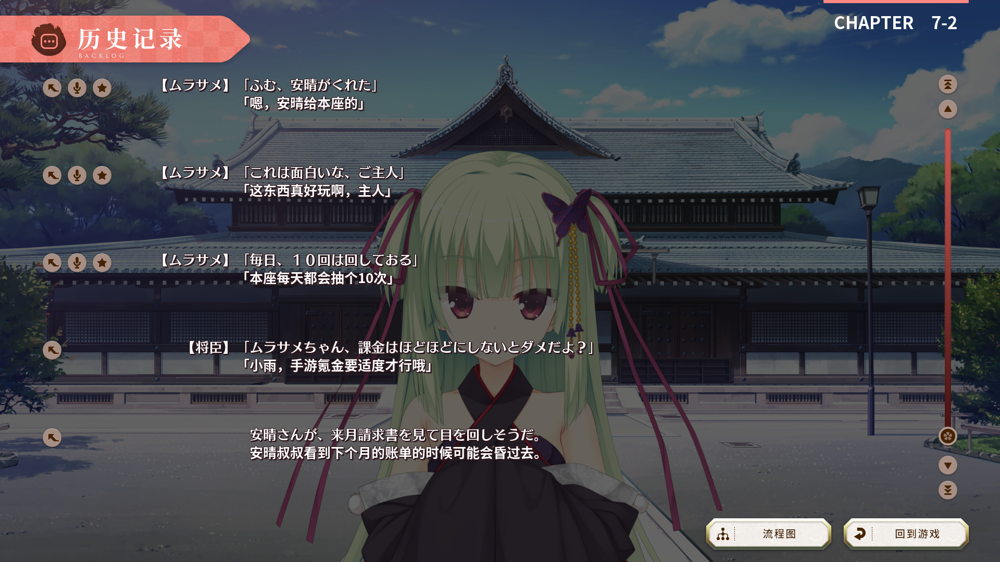

&nbsp;&nbsp;&nbsp;&nbsp;&nbsp;&nbsp;&nbsp;&nbsp;虽然丛雨只是一个3号主角，和主线也没有太大的关系，但在国内人气异常的高（不过其中似乎混入不少云玩家，悲）。这可能也是一种国内外的审美差距吧。另外虽然剧情上没有提到，但这大概是唯一一条诅咒没有真正解决的线，不过对游玩体验没什么影响就是了。在通关之前你可能根本都察觉不到这个问题。

甜蜜度：⭐⭐⭐⭐⭐⭐⭐⭐⭐⭐⭐⭐⭐⭐⭐⭐⭐⭐⭐⭐⭐⭐⭐⭐⭐⭐⭐⭐⭐⭐⭐

欢乐度：⭐⭐⭐⭐⭐

剧情贡献度：⭐

## 朝武芳乃

  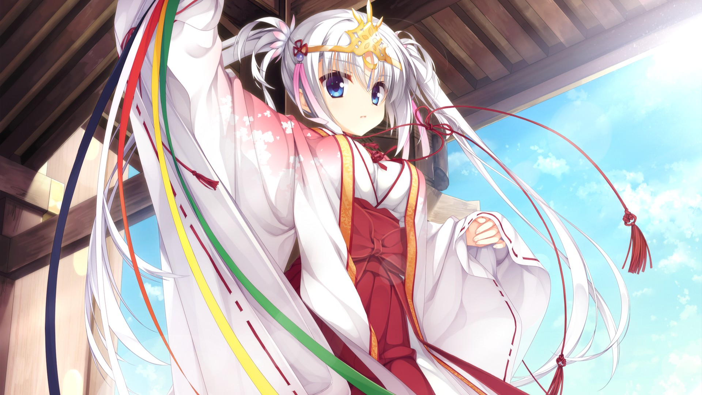
&nbsp;&nbsp;&nbsp;&nbsp;&nbsp;&nbsp;&nbsp;&nbsp;
	芳乃对待各种事情都特别认真，她待人有点冷淡，但其实是因为害怕别人因为自己的事情受牵连，总是替别人考虑太多。这种想法有时会在无意中伤害到他人，并让她与身边的人产生了距离感，自己也常常为此自责。 
&nbsp;&nbsp;&nbsp;&nbsp;&nbsp;&nbsp;&nbsp;&nbsp;
    芳乃也很缺乏情商和生活经验，在剧情中经常成为丛雨和茉子的迫害对象，给流程带来了不少的喜剧效果。例如恋爱过程中茉子和丛雨经常给她出一些馊主意，但芳乃都会一本正经的尝试照做。本作的搞笑担当（？。

&nbsp;&nbsp;&nbsp;&nbsp;&nbsp;&nbsp;&nbsp;&nbsp;
  	虽然前面吐槽了那么多，不过芳乃在这条线中的成长还是挺让人欣慰的。随着剧情推进她逐渐打开了自己的内心，告别了曾经的那个自己。剧情后期有一个母女和解的场景，个人感觉那是全作中最感人的一个场景。 
&nbsp;&nbsp;&nbsp;&nbsp;&nbsp;&nbsp;&nbsp;&nbsp;
    恋爱中，芳乃一开始表现的笨手笨脚，但和男主经过一次OO后就放飞了自我，变得越来越主动和开放了，每天想着要和男主开发新玩法，H程度非常之高。画师也是放飞了自我，什么都往里面画。
  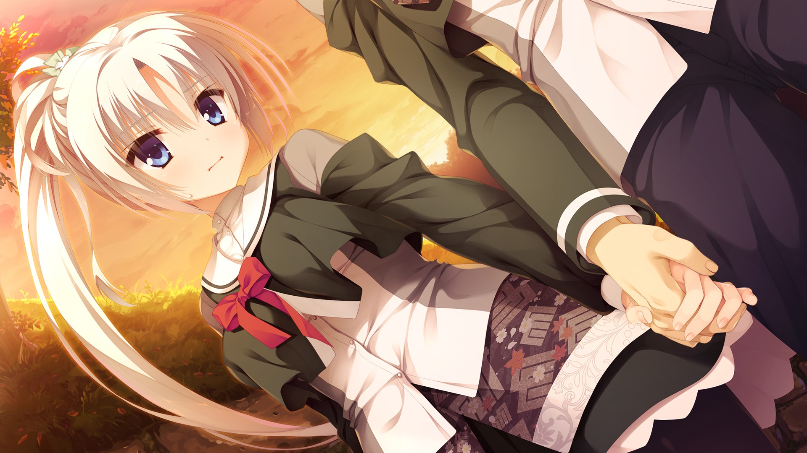

👇为自己的馊主意沾沾自喜的二人

    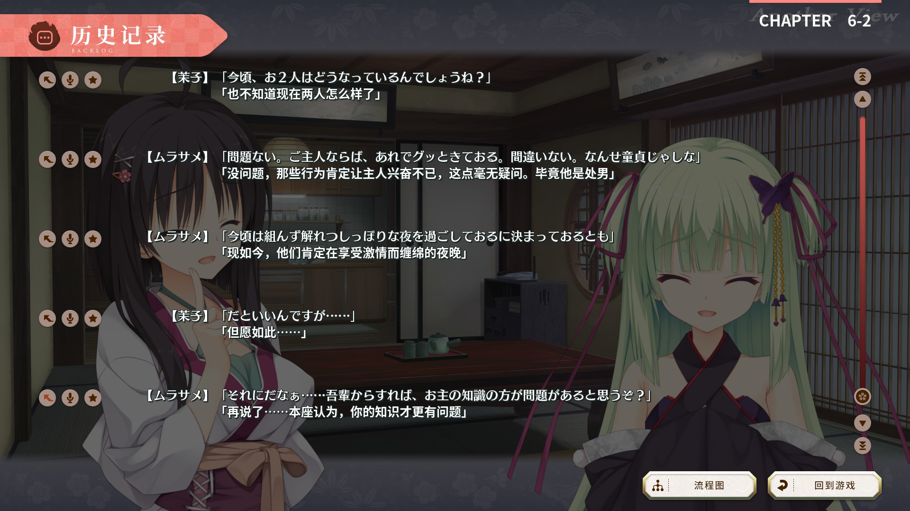

&nbsp;&nbsp;&nbsp;&nbsp;&nbsp;&nbsp;&nbsp;&nbsp;个人来说这条线存在一个小缺陷：它假定了芳乃和男主之前在普通路线上已经有了足够的发展（然而并没有），于是进入角色线后直接跳过了两人之间的任何发展，男主突然就意识到他爱上了她，并决定向她表白。我感觉有些不太自然。但也不是什么值得纠结的问题。还有诅咒虽然是解决了，但是这里解决诅咒的方法并不完美，关于诅咒的更多内幕信息也没有透露。这些问题可以在茉子和蕾娜的线中得到进一步的解答。

甜蜜度：⭐⭐⭐⭐

欢乐度：⭐⭐⭐⭐⭐

剧情贡献度：⭐⭐

## 蕾娜

  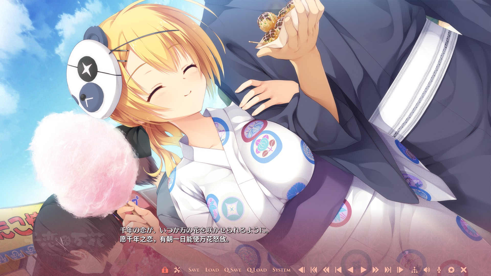
&nbsp;&nbsp;&nbsp;&nbsp;&nbsp;&nbsp;&nbsp;&nbsp;
    非常天真单纯的一个女孩，对待任何人都很好，始终保持乐观。从剧情上讲，她的路线是最完整的，诅咒问题被完美解决，其中的每一个谜团都被解开了，甚至其他女主角的背景也在她的路线上得到了突破，是真正的大团圆结局。不仅如此，这两人的相遇还能够和千年之前的事情对应起来，增添了不少的浪漫色彩。故事最后解释了标题「千恋万花」的含义。 

 
&nbsp;&nbsp;&nbsp;&nbsp;&nbsp;&nbsp;&nbsp;&nbsp;
    在共通线中，蕾娜给我留下了一些脑子不太聪明的感觉，我以为是个笨蛋角色。进入角色线后没想到她其实意外的是个相当成熟的人。有着自己的一套为人处世原则。 
&nbsp;&nbsp;&nbsp;&nbsp;&nbsp;&nbsp;&nbsp;&nbsp;
	可能是由于蕾娜的人设相比另外几位还是显得太普通了，再加上被大量的主线剧情占据了流程，减少了对这个角色的刻画机会，导致她的人气一直不怎么高，甚至和配角差不多。感觉有点变成剧情的牺牲品了。不过剧情真心写的挺好的。
    

👇凄惨的得票率。。。

    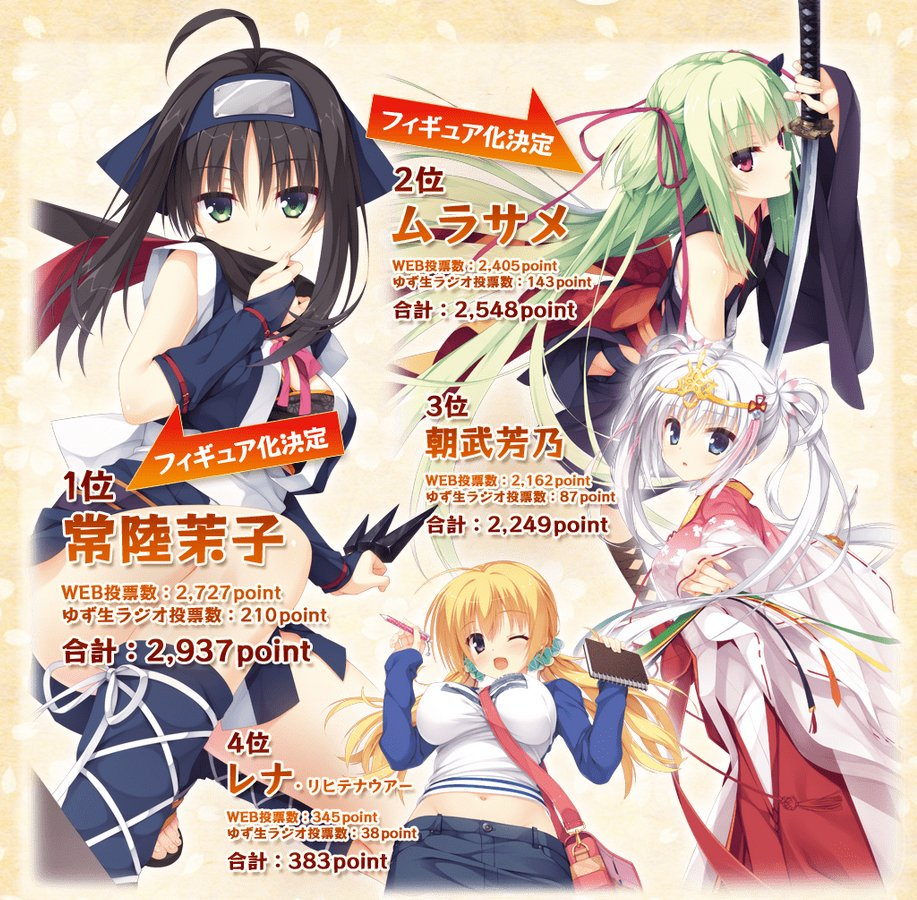

 

  
白山狛男神，汝勤事于穗织，数百年不懈守护之责，承当大义！
 
  
但念汝曾受切肤之痛，个中劳苦绝非一言可表……
 
  
汝之厚恩，皇天后土实所共鉴，然凡人不识，反以凶恶相报
 
  
愤慨之至，犹不可遏，实为无奈
 
  
盖汝素性仁厚，曾守护一方百姓，当受赞誉
 
  
余非问罪之人
 
  
仅代汝姊长告之矣
 

 

  ——蕾娜·列支敦瑙尔

甜蜜度：⭐⭐⭐

欢乐度：⭐⭐

剧情贡献度：⭐⭐⭐⭐⭐

## 常陆茉子

  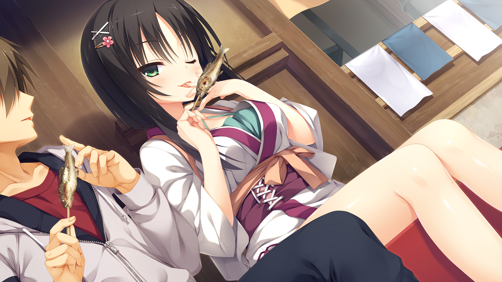
&nbsp;&nbsp;&nbsp;&nbsp;&nbsp;&nbsp;&nbsp;&nbsp;
  	老实说第一次遇到茉子的时候就挺让我心动的。当你刚来到一个陌生的地方，第一个遇到的好心人总会给人留下些特殊印象吧。在之后的展开的也越发觉得这是一个心地善良又很勤奋的好孩子，让人既佩服又有点心疼。 &nbsp;&nbsp;&nbsp;&nbsp;&nbsp;&nbsp;&nbsp;&nbsp;
    茉子因为工作的原因，没有什么自己的时间，不过她从来没有抱怨并对工作乐在其中。这在某种程度上也是一种自我催眠，她心里其实一直藏着某个「少女的秘密」，只是每次都用没时间之类的借口去回避它。而且她会对工作感到乐在其中更多的是因为没有经历过别的事情。 &nbsp;&nbsp;&nbsp;&nbsp;&nbsp;&nbsp;&nbsp;&nbsp;

&nbsp;&nbsp;&nbsp;&nbsp;&nbsp;&nbsp;&nbsp;&nbsp;
  	这条线提供了更多的剧情拼图，并且这些内容可能会颠覆你的以往认知。玩的过程中我开始重新梳理至今发生的一切，隐约感觉之前可能是误会了什么东西。后来我的这一想法在蕾娜线中得到了证实。这条线的最后依然是顺利解决了诅咒，并且解决方法比芳乃线中要更加完美。 &nbsp;&nbsp;&nbsp;&nbsp;&nbsp;&nbsp;&nbsp;&nbsp;
    恋爱方面，茉子的调皮性格给整个流程增添了不少的欢乐。总的来说也是比较有趣的一条线，能够让我们对诅咒和她的家族有更多的了解。
    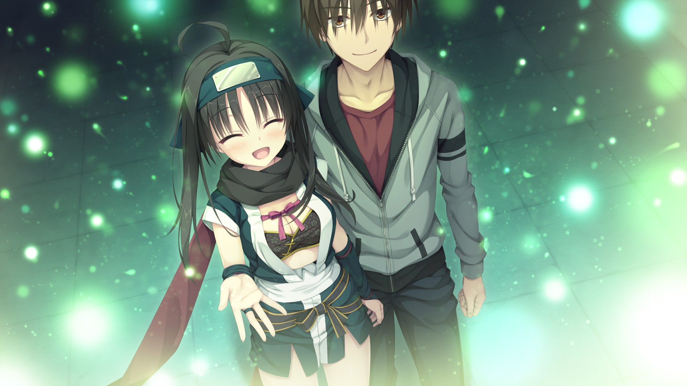

<table>
  <tr>
    <td>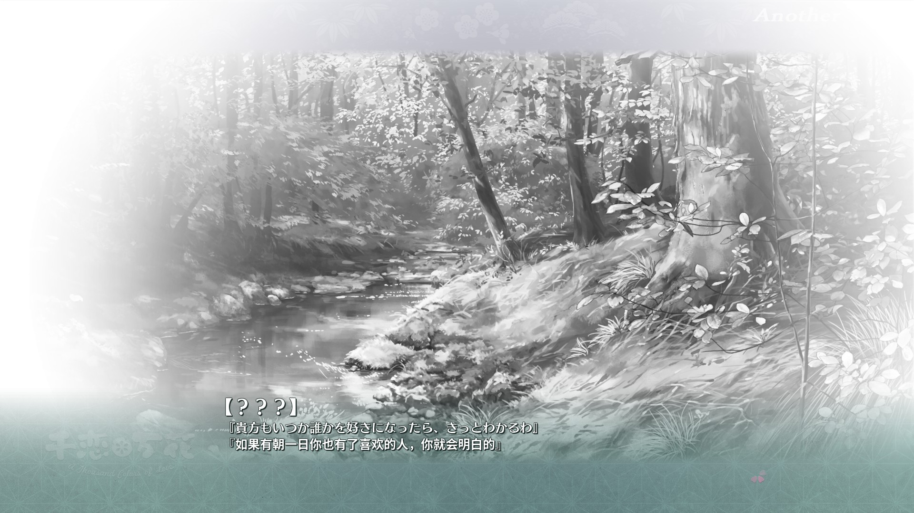</td>
    <td>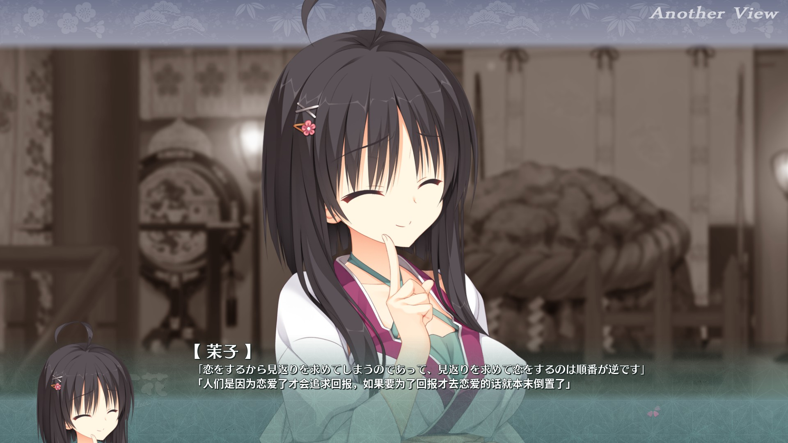</td>
  </tr>
</table>

👇其实是看少女漫画学的知识

    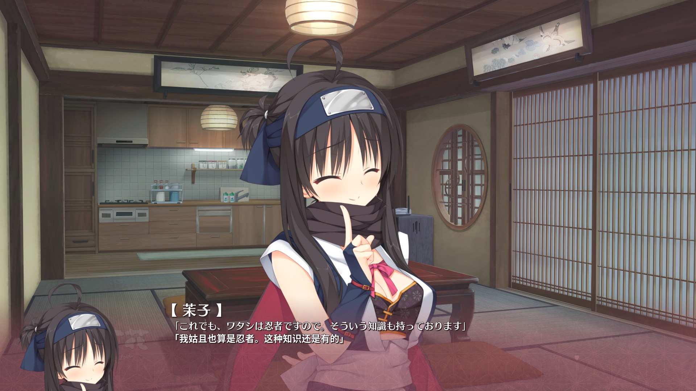

甜蜜度：⭐⭐⭐⭐

欢乐度：⭐⭐⭐⭐

剧情贡献度：⭐⭐⭐⭐

## 芦花&小春

&nbsp;&nbsp;&nbsp;&nbsp;&nbsp;&nbsp;&nbsp;&nbsp;
&nbsp;&nbsp;&nbsp;&nbsp;&nbsp;&nbsp;&nbsp;&nbsp;这两条线我没仔细玩，主要是我对小女孩和大姐姐都不怎么感兴趣。为了刷成就快速按ctrl键过完了。总体上似乎都是在讲日常，和主线没什么关系。芦花线看上去倒是还行，毕竟是青梅竹马而且在全线中她和男主一直互动挺多的，发展成恋人我觉得也很自然。小春的话我感觉她和男主好像也没有特别亲密，突然走向O之空剧情让我有点猝不及防。虽然柚子社每次在启动界面都会叠甲说角色已成年，但是小春再怎么看都是个未成年小孩吧！个人不是很喜欢这条线，不过毕竟也没仔细看过剧情所以就不做更多评价了。

---

    总结 

&nbsp;&nbsp;&nbsp;&nbsp;&nbsp;&nbsp;&nbsp;&nbsp;非常适合新人入门的galgame，氛围轻松愉快，内容合适，不需要什么门槛。故事设计暖心有趣，角色个性鲜明，玩完后能给人留下深刻印象。是消磨时光，补充萌萌能量的好东西。

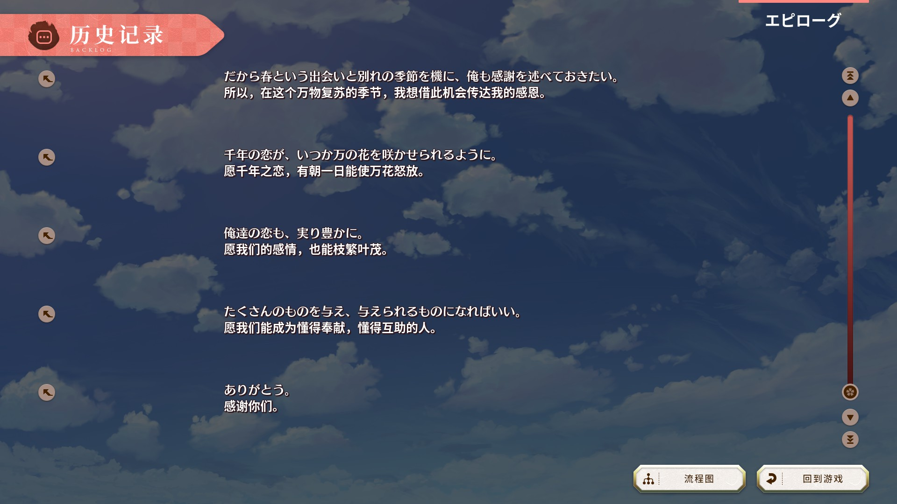

