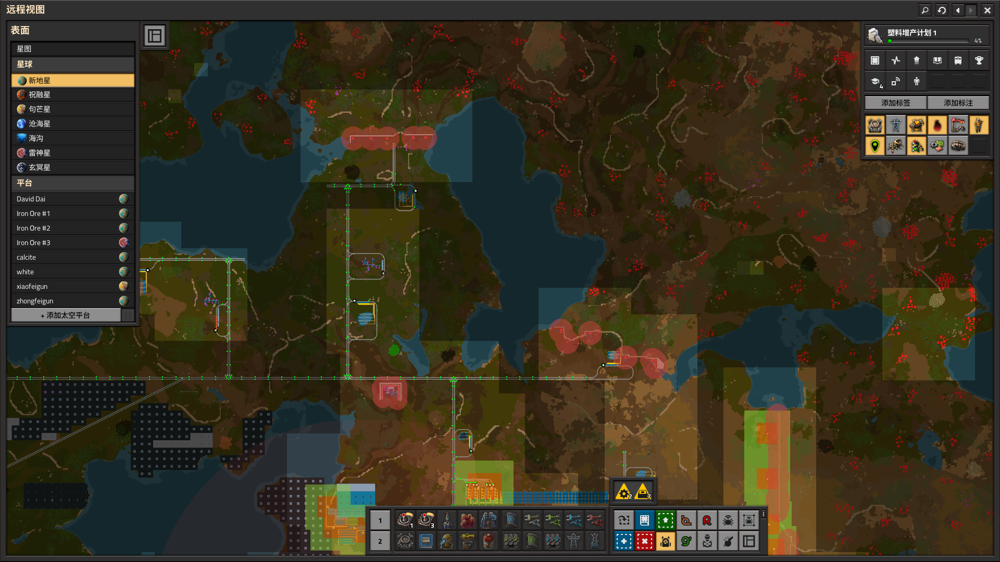
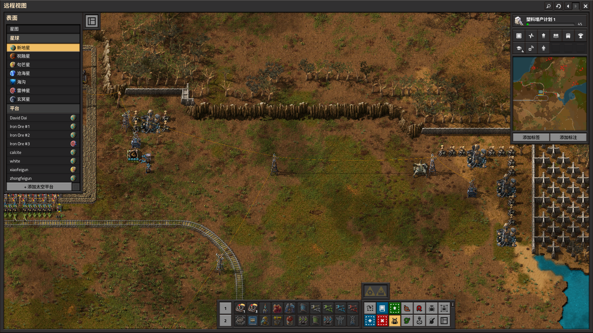
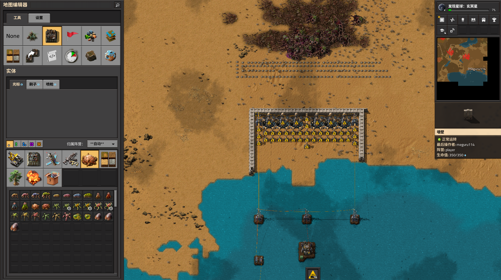
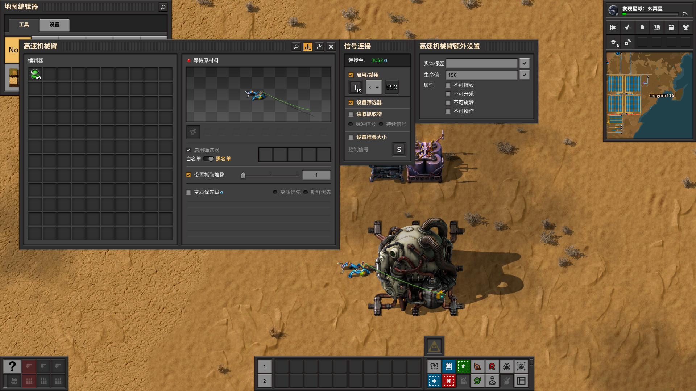
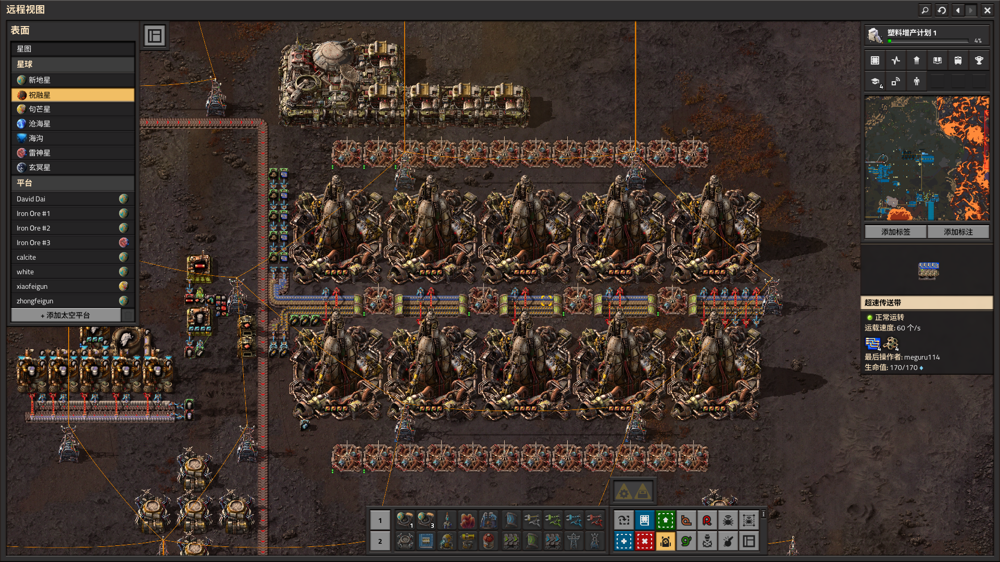
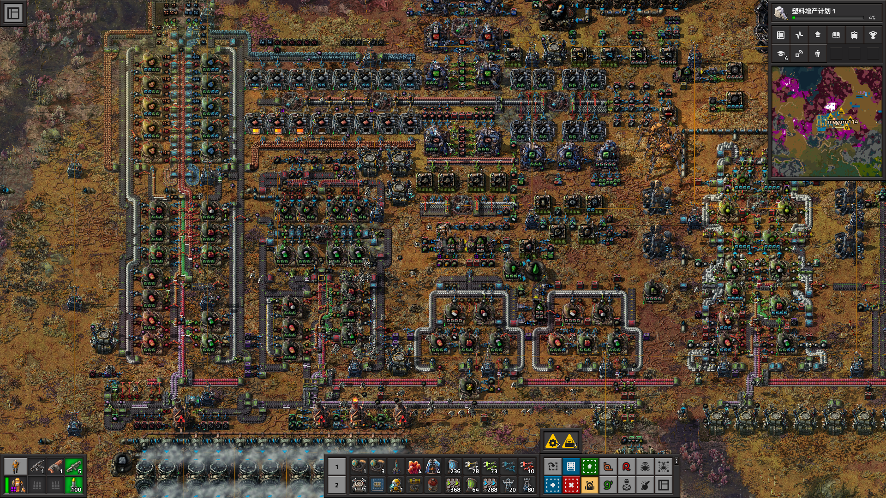
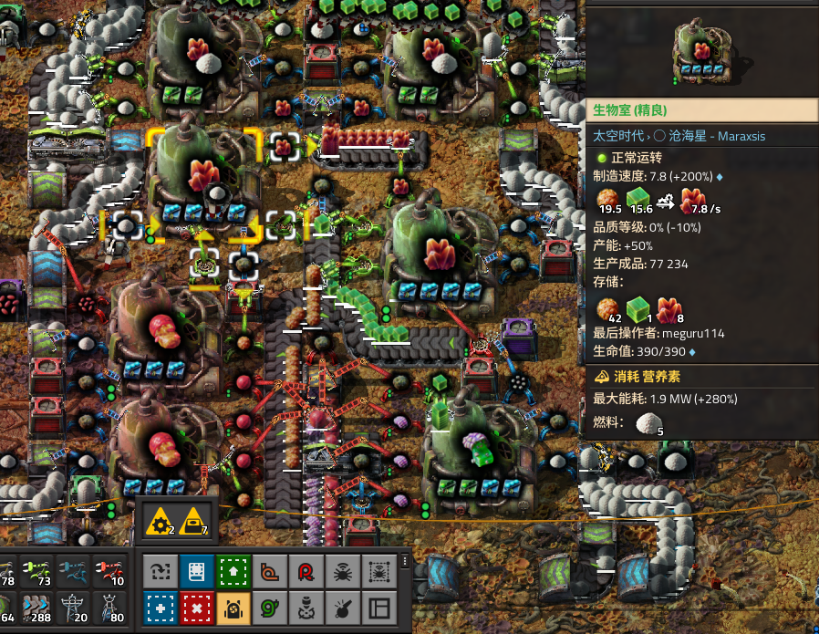
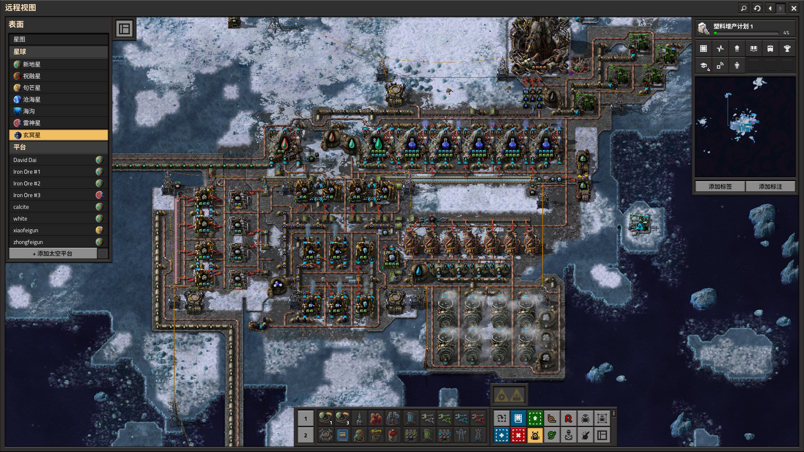
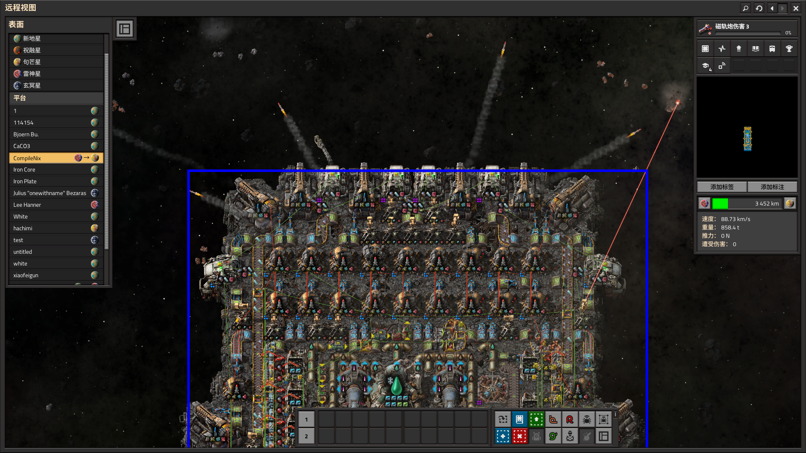
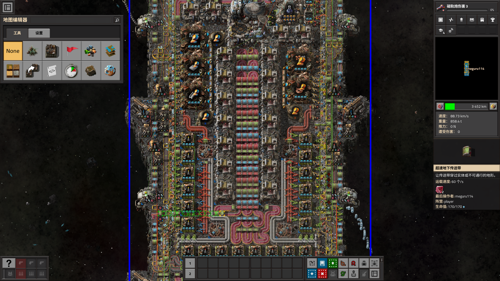

&nbsp;&nbsp;&nbsp;&nbsp;&nbsp;&nbsp;&nbsp;&nbsp;factorio各星球的一些总结。不一定是最优，只是个人玩下来感觉可行的一些经验。

---

    新地星 
    

&nbsp;&nbsp;&nbsp;&nbsp;&nbsp;&nbsp;&nbsp;&nbsp;老家，emm不知道说什么，先说点打虫子的心得好了，之后如果想到其他的再补充。前期感觉可以不用急着主动去进攻，做好防守就好了，因为进攻没什么收益而且还会加速虫子进化（除非虫子离基地太近了一直骚扰比较烦那样的话感觉可以去清理一下）。到了中期要扩大地盘的时候再去主动打虫子。可以一次性清理出一大片空地之后在虫子扩张的必经之路上设置前哨站用于防守。这样空地上就不会有虫子的骚扰了。

**关于防御：**

&nbsp;&nbsp;&nbsp;&nbsp;&nbsp;&nbsp;&nbsp;&nbsp;前期可以先用机枪炮塔把基地包围起来，前面放一排围墙，后面放一条传送带递子弹，然后再放一点建设机器人自动维修，这样就可以比较安稳的度过前期了，虫子基本上不会有什么存在感。如果有解锁激光炮塔的话也可以夹杂着放几个。做好这些防守后就可以去其他星球了（前期先不要把基地的规模弄得太大，差不多够用就可以了，因为之后利用从外星带回来的设施可以更高效的铺设产线，之前建好的产线也就被淘汰掉了）。走之前要是还不放心的话可以把产线关停，从而避免产生污染。虫子不吸收污染就不会主动进攻了。至于关停产线的方法就比较多了，比如可以在一些关键地方挖掉几节传送带，给一些机械臂随便转个角度，或者干脆给工厂断电。不过注意不要把机器人和炮塔的电断掉就好了。

&nbsp;&nbsp;&nbsp;&nbsp;&nbsp;&nbsp;&nbsp;从外星回来后差不多也可以开始扩张地盘了，这时候虫子的进化因子应该还没有多高，几个激光炮塔就可以轻松抵挡住虫子的扩张。放机枪应该也可以，但是维护起来比较麻烦，还是激光更方便。设置前哨站的时候可以利用悬崖以及一些狭窄地形以达到增强防守和减少材料消耗的效果。

    

&nbsp;&nbsp;&nbsp;&nbsp;&nbsp;&nbsp;后期随着进化因子的增加，虫子有时候进攻来的数量会非常多，单体输出的激光和机枪根本打不过来。这时候就需要增加一些具有aoe攻击的炮塔了。这里推荐两个神器，一个是特斯拉炮塔，另一个是火焰炮塔。用他们对付群怪完全没有压力。相比之下，这两个炮塔各有自己的优缺点，可以根据自己的喜好来决定使用哪一个。

**特斯拉炮塔：**

&nbsp;&nbsp;&nbsp;&nbsp;&nbsp;&nbsp;优点：

- 安装简单，随放随用。
- 不使用弹药，因此不太需要考虑后勤什么的。
- 攻击自带控制效果。

&nbsp;&nbsp;&nbsp;&nbsp;&nbsp;&nbsp;缺点：

- 耗电量极大。
- 制造成本比较高。
- 低品质的炮塔对群效果没那么强（不过用来防守虫子也已经很够用了）

    

**火焰炮塔：**

&nbsp;&nbsp;&nbsp;&nbsp;&nbsp;&nbsp;优点：

- 制造成本低。
- 不需要耗电。
- 对群效果极强。打1只虫子和打100只虫子的区别感觉不太大。

&nbsp;&nbsp;&nbsp;&nbsp;&nbsp;&nbsp;缺点：

- 攻击弹道有延迟，导致了冲在最前方的虫子只会受到较少的伤害。并且需要绑定围墙使用以增加命中率。
- 需要补充弹药，后勤工作比较麻烦。(不过好在弹药约等于免费)

    

&nbsp;&nbsp;&nbsp;&nbsp;&nbsp;&nbsp;只需要在原先的激光炮塔附近简单摆几个火焰炮塔或者特斯拉炮塔就可以挡住99%的虫子扩张了。至于为什么不是100%，因为到了后期可能会遇到一种比较狗屎的情况，虫子刚好在你的炮塔前方筑巢，这时候巨型沙虫的射程刚好可以白嫖你的炮塔。解决方法是增加几个重炮。不过这种事件发生的概率非常低所以不着急的话可以先选择性忽略emm。去完勾芒星后还可以解锁一个种树科技，这玩意也可以像围墙一样阻挡虫子的前进路线，而且虫子似乎还不太会主动攻击树木。所以还可以在前哨站的外面多种一点树（有火焰炮塔的话就算了）。如果没有开启dlc的话就只能用火焰炮塔了，不过也不用担心因为他的火力完全足够。而且没开dlc还有一个好处是重炮炮弹比较便宜，每次送补给的时候可以多送几发炮弹过去。

    

一个简单的前哨站👆。因为防守压力不大就没放机器人

&nbsp;&nbsp;&nbsp;&nbsp;&nbsp;&nbsp;由于前哨站对资源的消耗速度并不快，为避免后勤车一直无意义空跑可以用信号条件控制这些前哨车站的开启与关闭。

&nbsp;&nbsp;&nbsp;&nbsp;&nbsp;&nbsp;特斯拉炮塔的一种省电方法：检测附近有没有虫子，只有当虫子靠近的时候才接通电网。可以用地雷+建设机器人的组合来检测，往物流箱里放一些地雷，当虫子踩到地雷后机器人就会飞过去补充。检测机器人指令平台中的可用建设机器人数量，如果不等于某个数就接通电网。在机器人飞出去的这段时间内足够打死虫子了。理论上可行不过没有实际应用过，不清楚具体的实用性如何。

    

&nbsp;&nbsp;&nbsp;&nbsp;&nbsp;&nbsp;此外还有两种设想中但是未经过测试的方案：

- 蜘蛛机甲自动开火。由于蜘蛛机甲的射速极快并且火箭弹伤害也比较高，所以可以把他停在前哨站当成一种超级火箭炮塔来用。不过感觉成本有点高。在勾芒星或许可以用一用。
- 重炮车厢循环巡逻。感觉运行起来会很帅，但是不太好操作，而且一直巡逻对燃料的消耗也有点大（虽然后期也不缺这点燃料）。和直接在前哨站放重炮炮塔的效果应该差不多。

**关于进攻：**

&nbsp;&nbsp;&nbsp;&nbsp;&nbsp;&nbsp;以下流派命名纯属自己瞎编的不要在意

- 传统流：在巢穴附近放几个机枪炮塔，把虫子引过来全部乱枪扫死，趁着他们还没复活的时候去偷打几下巢穴（感觉用霰弹枪相性价比高一点，伤害高而且造价也很便宜），虫子复活后就撤退到炮塔附近然后重复之前步骤，循环几次就可以把巢穴打掉了。等清理掉前方的巢穴后可以顺势把炮塔往前推进，从而节省一些赶路的时间。优点是成本低，前期就可以做到。缺点是效率不高，而且机枪在遇到中期的虫子时感觉就有点吃力了。把机枪换成防御无人机或许也行，无人机相比机枪的优点是灵活性更高但是伤害略低。
- 飙车流：借助坦克或汽车这种高速移动载具在虫巢附近绕圈。把虫子都吸引到车后面吃尾气，然后不管他们直接先集火打掉虫巢，打完虫巢后再去清理剩下的虫子。汽车只在前期适用因为车载机枪的输出不高，而且汽车血量很少容易被虫子打的车毁人亡。坦克用炮弹打虫巢的效率就非常高了，只需一两炮就能干掉一个巢穴，清理完虫巢后可以用火焰喷射器解决剩下的虫子。驾驶坦克时需要特别注意的就是不要突然撞到石头或者水沟什么的，撞到基本上就完了。刚玩熟练度不高的情况下可以给坦克装一个放电防御模块，要是被虫子包围了就激活一下，有时候可以保命。
- 机甲流：多造几个蜘蛛机甲并给他们装一些火箭弹，然后遥控他们去打虫子，场面堪比rts游戏。机甲的火力非常猛，操作起来也很简单。瞬间就可以清理一大堆虫子。缺点是成本很高，这些机甲本身的造价就是一笔不小的开销，要是插模块的话还要更贵。而且火箭弹消耗量也很大，外出随便走几下可能就要用掉好几k的火箭弹。爆破火箭弹感觉是陷阱，经常鞭尸浪费子弹，还容易炸到自己，用普通的火箭弹感觉比较好。
- 重炮流：搞一辆挂载几十节重炮车厢的火车，之后看哪里的虫子不爽了就可以把车开过去放炮。效率也比较高，而且炮弹满天飞的画面比较解压。缺点是需要设计铁路，车厢太长有撞坏其他火车的风险，以及容易引来大波虫子进攻。开炮之前需要提前设置好防御。

**炮塔的放置位置：**

&nbsp;&nbsp;&nbsp;&nbsp;&nbsp;&nbsp;TODO 

&nbsp;&nbsp;&nbsp;&nbsp;&nbsp;&nbsp;关于发电：前期先造几个蒸汽机凑合着用，然后转型核能或者太阳能。简单总结一些他们各自的注意事项：

**太阳能：**

&nbsp;&nbsp;&nbsp;&nbsp;&nbsp;&nbsp;占地面积极大，所以在铺设之前需要考虑好假如把太阳能放在这里会不会对后续的产线造成影响。可以尽量放在一些偏僻的地方以减少占地的影响。据<a href="https://forums.factorio.com/viewtopic.php?f=5&t=5594" target="_blank" rel="noopener noreferrer">大佬计算</a>太阳能板和蓄电器的最佳比例为1：0.84或者说25：21，铺设的时候可以参考这个数值。太阳能板的产速不需要多高，因为是每隔一段很长的时间才会去扩建，只要在这段时间内能产出1000多个差不多就够用了。

**核能：**

&nbsp;&nbsp;&nbsp;&nbsp;&nbsp;&nbsp;&nbsp;可以节省大量面积，但缺点是需要设计配套的维护设施。给核反应堆递燃料的爪子可以像这么设置来节省燃料（核反应堆端设置勾选读取燃料和读取温度）：

    

&nbsp;&nbsp;&nbsp;&nbsp;&nbsp;&nbsp;&nbsp;&nbsp;由于我目前对核能用的不是很多所以就先不写别的了。

---

    祝融星 
    

&nbsp;&nbsp;&nbsp;&nbsp;&nbsp;&nbsp;&nbsp;个人认为最爽的图，无限硫酸+铁铜石矿+虫子不会主动骚扰。后期感觉可以把一些产业都搬到这里，像是红绿瓶什么的在这里生产就非常方便。更加高级的产业也不是不能做，但是煤炭消耗量太大了，因为这星球上没有石油所以想获取各种石油制品都要靠煤炭液化。后期可以考虑从勾芒星进口塑料以减轻石油压力。

&nbsp;&nbsp;&nbsp;&nbsp;&nbsp;&nbsp;&nbsp;前期刚到的时候会面临两个难点，一个是祝融星的地形比较狗屎不方便放建筑，另一个是家旁边会有虫子巡逻。前者需要先忍受一下等到解锁悬崖炸药后问题基本上就不存在了。后者我一般是用坦克+贫铀炮弹的打法。用坦克正面和虫子硬刚感觉有点难度，容易翻车，不过我发现一个有点逃课的打法：可以把坦克放在虫子的侧面或者后面，然后就可以按住开火键不松开。虫子受到攻击后会先尝试调整身位而不是发起攻击，在他调整身位的这段时间内贫铀炮弹就足以打死他了。用这种方法可以轻松无伤打死小型的虫子，至于中型和大型的虫子用坦克输出就不太够了，不过也没必要去打他们，打死几条小型的拿下几块地盘就够了。至于其他方法我还没试过，不过感觉坦克就挺好用的。科技要求：动能武器射速点满，伤害好像可以不用点太多，能点多少就点多少吧。如果想打中型和大型的虫子可以等后期解锁了磁轨炮再回来打，找好角度一枪就可以秒杀虫子。

&nbsp;&nbsp;&nbsp;&nbsp;&nbsp;&nbsp;&nbsp;还有一点是我感觉祝融星上的流体运输不太方便，一方面这些流体本身的制取不那么方便，不像老家那样随地放个抽取泵就有水，另一方面也和地形有关，主要是前期还没解锁悬崖炸药的时候，想要铺设管道简直是地狱难度。所以我用了钢桶大法，用钢桶装流体然后用机器人把桶运到需要的地方。当然这种方法只适用于小规模的工厂，后期如果想大规模生产的话还是用液罐车厢来运输流体吧，或者感觉也可以用流体总线。其他方面感觉就没什么特别的了，后期的开发思路应该和老家差不多。

&nbsp;&nbsp;&nbsp;&nbsp;&nbsp;&nbsp;&nbsp;关于火箭发射井：这几颗外星的资源都比较丰富，很容易实就可以实现火箭自由，因此可以多造几个火箭，从而一次性发射大量物资，方便在星球之间运送物资。例如我就一次性放了10个发射井，感觉其实还可以更加大胆一点的。不过物流机器人的数量也要跟上，不然给火箭运东西要运好久。

    

---

    勾芒星 
    

&nbsp;&nbsp;&nbsp;&nbsp;&nbsp;&nbsp;&nbsp;也是无限资源的一颗星球，但是资源获取方式没有祝融星那么简单粗暴，需要动一点脑子。前期营养素的获取主要靠变质物，可以用插了节能插件的生物室来搓营养素，能节省一些材料，有高品质的生物室就更好了。后期主要用生物结晶制营养素，产量非常夸张基本上不愁用了。我目前的产线结构采用的是<a href="https://forums.factorio.com/viewtopic.php?f=5&t=5594" target="_blank" rel="noopener noreferrer">资源总线</a>的方法，感觉扩展起来比较方便，要用果子的地方直接从总线上接几个分流器出去就好了。只不过我用的总线比较简陋上面只有2种果子。感觉不能用机器人来运果子，因为机器人的吞吐量不太稳定，容易造成间歇性的停产。而且由于果子的需求量比较大，运输距离可能也比较远，导致机器人一直在飞，耗电非常厉害。我一开始想的是果子一直放在传送带上可能要烂掉，而且传送带上一次放那么多果子有点浪费，用机器人可以达到要多少运多少的效果，可能比较合适。后来发现是多想了，产线运行起来后种子的数量是越来越多，根本不用担心浪费。种子倒是可以用机器人来运，因为流量不是很大所以耗电可以接受，传送带铺起来感觉还是有点麻烦的。后期如果要大规模生产的话感觉可以用火车来运果子。

    

**铺设产线的注意事项：**

&nbsp;&nbsp;&nbsp;&nbsp;&nbsp;&nbsp;&nbsp;&nbsp;对于生物室，除了输入原材料和输出成品外，还需要额外设置2个爪子，一个用于输入营养素，另一个用于输出变质物。如果是加工果子的生物室可能还需要额外的第三个爪子用来输出种子（或者用一个爪子来同时抓变质物和种子感觉也行）。一开始我想用传送带把这些变质物种子什么的都收集到一起，后来感觉传送带要扭来扭去的太麻烦了，干脆换成了物流箱，产线看上去就清爽了许多。我感觉最好用紫箱，不然物品容易堆积。变质物可以拿去做碳和节能插件3，或者送去回收机刷品质，多余的送给供热塔烧掉。种子优先送给菜地，多余的可以拿去做点土壤或者烧掉。

&nbsp;&nbsp;&nbsp;&nbsp;&nbsp;&nbsp;&nbsp;&nbsp;传送带也需要一些额外的处理，在所有变质物可能会堆积的地方都需要放置机械臂来及时抓走变质物（感觉主要是每条传送带的末端，以及环形传送带）。总线上也可以分布一些爪子来抓变质物。这些特点的存在导致产线铺设起来感觉有点麻烦。一开始我是在每个工厂外围放了2条环形传送带，一条用来放营养素另一条用来放变质物，后来想了下感觉这两条其实可以合并的，再想了一下感觉变质物可以直接送进紫箱不需要上传送带。

**关于营养素的获取：**

&nbsp;&nbsp;&nbsp;&nbsp;&nbsp;&nbsp;&nbsp;一开始我采取的措施是每个工厂都独立生产营养素，也就是都从头开始走一遍“果冻果加工-玉玛果加工-生物结晶-生物结晶制营养素“这样的流程。但是多造了几个工厂后感觉存在一个明显的弊端：查重率太高了，而这些重复的结构占用了大量的空间。在另一方面，每增加一个这种结构意味着要增加配套的变质物，种子，营养素的处理，感觉铺设起来有点累。还有一些营养素的消耗大户（例如草瓶）有时候会出现营养素断供的情况。想了下感觉结构可以优化一下，选定一块地方集中生产生物结晶，然后用机器人把生物结晶送到需要的工厂，送到后直接就可以开启“生物结晶制营养素”这个步骤。这种方法的缺点可能是存在一些浪费，以及一旦一处停产就要处处停产。但在勾芒星浪费不是什么问题，只要保证产量略高于消耗应该就不会断供。扩建起来也比较方便，只需要在这一处地方增加生物结晶产量就可以了。

**关于防守：**

&nbsp;&nbsp;&nbsp;&nbsp;&nbsp;&nbsp;&nbsp;重点防守菜地，如果菜地和虫巢的连线之间存在其他建筑的话可能在路上也要设置一些防守，不然虫子路过的时候一脚就把建筑踩爆了。我目前用的是特斯拉炮塔+蜘蛛机甲的组合，暂时能守住但是毕竟玩的时间也不长，不知道后期还能不能撑住。特斯拉炮塔的电流可以在虫子的脚上反复弹射从而一发就造成大量伤害和控制效果，蜘蛛机甲停在特斯拉炮塔旁边自动开火，可以补充一些火力。当人不在勾芒星的时候也可以随时用遥控器远程操控，去处理一些突发情况什么的。至于给的那个火箭炮塔感觉是陷阱，输出太低了没打几下还容易罢工。感觉还不如把火箭弹塞给蜘蛛机甲，战斗力比炮塔高多了。

**关于草瓶：**

&nbsp;&nbsp;&nbsp;&nbsp;&nbsp;&nbsp;&nbsp;草瓶的生产要用到虫卵，这会带来安全隐患。感觉这里的重点是生产不要停，一旦停下来虫卵不能及时消耗就会慢慢变质。以下列举了一些我遇到的会导致停产的原因：

- 草瓶的生产速度太快导致箱子被填满 
  解决方法：增加几个箱子

- 工厂内堆积了太多变质物没有及时拿走 
  解决方法：用紫箱。另外要注意草瓶也会变质。

- 营养素断供 
  主要是培养五足虫卵对营养素的消耗量太大了，营养素容易被虫卵全部耗完导致其他生物室停止工作。此外还有一个不常用但是可能比较容易让人忽略的点是，在给产量做配比的时候也要考虑到爪子的速度。例如我下面这个插了4个速度插件的生物室，每秒钟要消耗30多个原材料，一开始我只放了1个集装机械臂好像抓不过来，导致生物结晶的产量跟不上也会造成营养素断供。用加长机械臂的时候更要小心。

  

      
  

  解决方法（暂时）：因为这里我的营养素消耗速度接近100/s，超过了一条绿色传送带的运力，一开始我尝试了堆叠传送带的方法，但好像还是不太稳定，因为各生物室之间对营养素存在比较严重的抢夺问题。后来我在运输营养素的环形传送带周围均匀放置了几个绿箱用来补充营养素，情况好像得到了改善。如果采用集中生产生物结晶的方法或许也可以改善这个问题。或者降低单个工厂的产量，多复制几个同样的工厂。

**关于发电：**

&nbsp;&nbsp;&nbsp;&nbsp;&nbsp;&nbsp;&nbsp;&nbsp;感觉主要是靠供热塔+火箭燃料。火箭燃料的产速可以稍微大一些，供热塔可以采用和之前的核能一样的节能方法。可以放几个供热塔专门用来烧变质物，补充一点电量的同时清理多余的垃圾。

---

    雷神星 
    

&nbsp;&nbsp;&nbsp;&nbsp;&nbsp;&nbsp;&nbsp;也是爽图，资源也约等于无限（感觉前面这几个星球资源都挺多的）而且没有虫子骚扰，缺点是产物比较混乱，感觉这颗星球主要是考验玩家处理混料的能力。雷神星的特点是小岛资源多但是没什么空间放建筑，大岛空间多但是没什么资源。所以可以把他们结合一下，在小岛只负责采矿，利用火车把他们拉到大岛去做产线。

**关于品质插件的使用：**

&nbsp;&nbsp;&nbsp;&nbsp;&nbsp;&nbsp;&nbsp;我之前是给所有的回收机都装上了品质插件，虽然一直出货比较爽但是生产一段时间后发现产物实在是太混乱了，而且生产速度也有点慢，感觉回收机可能还是插速度插件好一点。

**废料回收各产物的一些处理思路：**

&nbsp;&nbsp;&nbsp;&nbsp;&nbsp;&nbsp;对于堆积起来的产物要大胆销毁，不要舍不得。可以利用多余材料来做一些乱七八糟的东西来减少浪费，例如核反应堆，汽轮机，离心机什么的。

**铁齿轮**

&nbsp;&nbsp;&nbsp;&nbsp;&nbsp;&nbsp;&nbsp;用途：分解获得铁板，或者直接用来生产各种产品，用处比较多。

&nbsp;&nbsp;&nbsp;&nbsp;&nbsp;&nbsp;&nbsp;销毁思路：先分解成铁板，然后扔进嘴对嘴的回收机。

**固体燃料**

&nbsp;&nbsp;&nbsp;&nbsp;&nbsp;&nbsp;用途：生产火箭燃料。后期也可以给供热塔用于发电。

&nbsp;&nbsp;&nbsp;&nbsp;&nbsp;&nbsp;销毁思路：扔进嘴对嘴的回收机或者供热塔。

**标准混凝土**

&nbsp;&nbsp;&nbsp;&nbsp;&nbsp;&nbsp;&nbsp;用途：直接铺在岛上；生产钢筋混凝土（可以进一步生产高架铁路，电磁工厂）。

&nbsp;&nbsp;&nbsp;&nbsp;&nbsp;&nbsp;&nbsp;销毁思路：做成标识混凝土然后回收。

**冰块**

&nbsp;&nbsp;&nbsp;&nbsp;&nbsp;&nbsp;&nbsp;用途：融冰生产水，后期也可以结合供热塔使用来发电。或者用于重油裂解。不过感觉石油资源在雷神星用处不太大，重油只能做润滑油，轻油可以做火箭燃料和超导体，但是他们的需求量都不大。石油气就更没用了，因为他要搭配煤炭使用才能生产塑料，而雷神星上没有煤炭。石油气用来做硫磺和蓝瓶倒是还行，产量还挺高，但是老家的那点产量就已经够用了。

&nbsp;&nbsp;&nbsp;&nbsp;&nbsp;&nbsp;&nbsp;销毁思路：扔进嘴对嘴的回收机。

**石矿**

&nbsp;&nbsp;&nbsp;&nbsp;&nbsp;&nbsp;&nbsp;用途：主要用于生产钬溶液。也可以做一点电炉和紫瓶。

&nbsp;&nbsp;&nbsp;&nbsp;&nbsp;&nbsp;&nbsp;销毁思路：做成填埋材料然后回收。

**钢材**

&nbsp;&nbsp;&nbsp;&nbsp;&nbsp;&nbsp;&nbsp;用途：和铁齿轮差不多，用于生产各种物品。

&nbsp;&nbsp;&nbsp;&nbsp;&nbsp;&nbsp;&nbsp;销毁思路：做成钢箱然后回收。

**电池**

&nbsp;&nbsp;&nbsp;&nbsp;&nbsp;&nbsp;&nbsp;用途：制作机器人构架（黄瓶），蓄电器，超级电容器。也可以做一点激光炮塔；分解获得铁板和铜板，可以用来制造电路板。

&nbsp;&nbsp;&nbsp;&nbsp;&nbsp;&nbsp;&nbsp;销毁思路：做成蓄电器然后分解？

**铜缆**

&nbsp;&nbsp;&nbsp;&nbsp;&nbsp;&nbsp;&nbsp;用途：主要用于制作电路板，也可以做一些插件效果分享塔和电线杆什么的。

&nbsp;&nbsp;&nbsp;&nbsp;&nbsp;&nbsp;&nbsp;销毁思路：感觉不太需要销毁，因为电路板的产量总是不太够

**集成电路**

&nbsp;&nbsp;&nbsp;&nbsp;&nbsp;&nbsp;&nbsp;用途：分解获得塑料，电路板和铜缆；直接用于制造各种产品

&nbsp;&nbsp;&nbsp;&nbsp;&nbsp;&nbsp;&nbsp;销毁思路：不知道，用回收机慢慢分解？

**处理器**

&nbsp;&nbsp;&nbsp;&nbsp;&nbsp;&nbsp;&nbsp;用途：分解获得大量电路板；用于制造其他产品和发射火箭。

&nbsp;&nbsp;&nbsp;&nbsp;&nbsp;&nbsp;&nbsp;销毁思路：不知道

**轻质结构**

&nbsp;&nbsp;&nbsp;&nbsp;&nbsp;&nbsp;&nbsp;用途：分解获得塑料和其他物品。这貌似是在雷神星上生产塑料的主要途径；用于制造其他物品和发射火箭。

&nbsp;&nbsp;&nbsp;&nbsp;&nbsp;&nbsp;&nbsp;销毁思路：不知道

**钬矿**

&nbsp;&nbsp;&nbsp;&nbsp;&nbsp;&nbsp;&nbsp;用途：貌似只能用于生产钬溶液。钬溶液可以用来生产雷神星的各种特产物品。

&nbsp;&nbsp;&nbsp;&nbsp;&nbsp;&nbsp;&nbsp;销毁思路：只要加大特产物品的产量的话，钬矿应该不会堆积。

&nbsp;&nbsp;&nbsp;&nbsp;&nbsp;&nbsp;&nbsp;个人感觉**电池，混凝土，冰块，铁齿轮，固体燃料，石矿，钢材**这几个比较容易堆积，需要重点关注。

**关于产线的结构**：

&nbsp;&nbsp;&nbsp;&nbsp;&nbsp;&nbsp;由于废料回收的产物太复杂了，如果不想动脑的话可以直接全靠机器人。我目前就是用了几千个机器人，好处是设计产线的时候非常方便，随便找一块空地放上几个物流箱就是一片新的产线了。不过坏处是这样搭出来的产线基本上处于一种失控的状态，完全无法维护和优化（当然和我的熟练度也有关系），而且机器人多了电脑可能也比较容易卡。感觉用传送带的话产线可能会更美观，也更加可控，能做好的话也会比较有成就感，之后打算挑战一下用传送带吧。当然纯靠传送带也不行，那纯属就是折磨自己了。适当使用机器人可以极大降低产线的复杂程度。

**关于电力：**

&nbsp;&nbsp;&nbsp;&nbsp;&nbsp;&nbsp;搓粉瓶的时候要用到蓄电器，可以给搓蓄电器的电磁工厂装上品质插件，低品质的拿去搓瓶子，高品质的就拿去用。高品质的蓄电器比普通品质的厉害很多。后期可以放几个供热塔，既可以销毁多出来的固体燃料也可以补充一点电力（要是纯用蓄电器的话，连续发射火箭的时候可能会停电）。不过要注意分离电网，只有当蓄电器快要顶不住的时候才启动汽轮机。

---

    玄冥星 
    

&nbsp;&nbsp;&nbsp;&nbsp;&nbsp;&nbsp;&nbsp;没有铁，铜，石头等基础资源，大部分物资都要依赖进口。感觉难点在于前期的启动（要解决供电和供热两大问题）。落地后可以马上先找个角落放出太阳能板和蓄电器，并且在这附近不要放其他的用电设施（我一开始就是放了个组装机结果挂机几小时一点电都没冲进去，后来发现那一堆太阳能板的发电功率还不如组装机的待机功耗）。放好后就可以一边规划产线一边等他自己慢慢充电。虽然玄冥星的太阳能发电量很低但是作为之后的启动资金也够用了。

&nbsp;&nbsp;&nbsp;&nbsp;&nbsp;&nbsp;要解决供电和供热的问题可以先铺设一个生产固体燃料或者火箭燃料的产线。感觉产线本身不难设计，因为用到的都是简单材料。主要是结构上由于处处要用到热管，第一次尝试的时候可能会不习惯。我感觉设计的要点是建筑之间要多留空隙，方便穿插热管。以及多用加长机械臂。不需要机械臂的情况下可以采用**建筑-管道-热管**这样的结构，需要机械臂的话就用**建筑-加长机械臂-热管-传送带**这样的结构。

&nbsp;&nbsp;&nbsp;&nbsp;&nbsp;&nbsp;&nbsp;铺设产线的时候可以注意一个这个细节：地下传送带和地下管道的耗热量非常高，是普通传送带或者管道的100多倍，所以能不用就尽量不要用吧，但是遇到那种实在很想用的情况放心用就是了，热量后期是不缺的。

&nbsp;&nbsp;&nbsp;&nbsp;&nbsp;&nbsp;等产线设计好后，之前用蓄电器攒的电就可以派上用场了。但要特别注意不要把整个产线全部接入电网，不然这些电估计不到几秒就被全部耗光了。这些珍贵的电应该全部用于融冰生产水（可以手动给化工厂添加冰块），与此同时也可以开始准备供热方面的工作了。多放几个供热塔然后给每个塔都放一组火箭燃料，不够的话之后再加，感觉1组可能不够用。等温度达到500多度后换热器就会开始工作，将之前融冰产生的水转化为蒸汽。等有了一定蒸汽后就可以把产线剩下的部分也接入电网了。此时宣告着基础的电热问题得到了解决。

    

---

    太空平台 
    

TODO

#### **防御：**

&nbsp;&nbsp;&nbsp;&nbsp;&nbsp;&nbsp;&nbsp;飞船在移动的时候只有正前方会刷星岩，而且此时星岩的移动方向为竖直向下，只有在停靠的时候侧边才会刷星岩，尾部不会刷星岩。所以重点防御船头部分，侧面只要放少量几个炮塔做到火力全覆盖就好了。TODO

#### **补给**：

&nbsp;&nbsp;&nbsp;&nbsp;&nbsp;&nbsp;&nbsp;有两种策略，一种是从地面发射火箭送补给（飞船的弹药，燃料什么的），另一种是利用星岩抓取臂和破碎机等物品在太空里实现自给自足。前者的好处是飞船可以设计的比较小巧（从而容易达到比较快的速度），设计难度和制造成本也都比较低。但是缺点是如果想要在一个地方长期停靠的话就必须在对应星球的表面放置一个给飞船送补给的产线，而且需要占用一些火箭带宽用来给飞船送资源（不过好在在玄冥星和新地星以外的星球上发射火箭基本上等于不要钱）。后者则是制造成本比较高，设计难度也高，但是一旦造好之后就不太需要维护了，用起来比较安逸。

&nbsp;&nbsp;&nbsp;&nbsp;&nbsp;&nbsp;&nbsp;如果要自给自足的话，由于太空平台上空间比较紧张，不方便随意铺设传送带。通常做法是使用一条混带来运送各种材料，这样造出来的飞船结构会更加紧凑。不过弹药还是需要一条独立的传送带，因为混带的容量比较小，如果把弹药也往上放的话容易出现弹药耗尽的情况。

##### **如何避免混带堵塞：**

&nbsp;&nbsp;&nbsp;&nbsp;&nbsp;&nbsp;&nbsp;TODO

#### **自动化**：

&nbsp;&nbsp;&nbsp;&nbsp;&nbsp;&nbsp;&nbsp;可以把太空平台当作某种火车来用。TODO

#### **其它用途：**

&nbsp;&nbsp;&nbsp;&nbsp;&nbsp;&nbsp;可以用太空平台来刷资源。TODO

TODO

---

    破碎星球 
    

&nbsp;&nbsp;&nbsp;&nbsp;&nbsp;&nbsp;去破碎星球是为了收集钷素星块用于科研。不过路上的星岩密度非常夸张所以飞船需要配备充足的火力，而且航行时间比较长所以如果想让飞船依靠地面补给感觉是不太现实了。个人测试了几把下来感觉用激光+磁轨炮+爆破火箭弹这种组合比较可行。磁轨炮锁定巨型星块，激光炮塔锁定小型星块，剩下的全部交给爆破火箭弹。至于为什么要用爆破火箭弹，因为我发现即使飞船速度降到很低依然会面临不小的星岩密度，而爆破火箭弹面对这种情况就没什么压力。而且用爆破火箭弹还可以给飞船做速度控制，当爆破火箭弹的数量大于某个值时可以多开1个引擎，因为是aoe伤害所以面对更多的星岩依然能够处理的过来。如果用普通火箭弹或者机枪的话，低速行驶的时候压力就已经很大了，高速就更别想了。飞船上可以多带点修理包以应付突发情况。

&nbsp;&nbsp;&nbsp;&nbsp;&nbsp;&nbsp;这种采矿船的另一个难点是钷素星块的存储。感觉可以使用堆叠传送带技术，也就是混用各色的地下传送带，在地下部分的容量是可以叠加的。通过这种方法就能在较小的空间内储存较多石头。

&nbsp;&nbsp;&nbsp;&nbsp;&nbsp;&nbsp;如果对怎么设计飞船心里没什么底的话，可以先在地图编辑器模式下进行测试。刚开始的时候可以借助永续箱，永续管，电力接口这些东西（我愿意称他们为调试工具），把对资源的担忧先抛到一边。这样的好处是方便确定飞船的一些初始参数。比如你一开始希望设计一艘时速200km/s的飞船，但是不知道在这种速度下需要多少的弹药产速，或者不知道该用什么炮塔。这时候如果用了那些调试工具就可以低成本试错，因为你不需要在飞船上放置任何产线，只要单纯摆放炮塔和推进器就好了。放好这些后就可以让飞船去试飞，并观察弹药消耗速度和防守压力。如果发现防守压力太大，可以采取多放几个炮塔，降低飞船速度，更改炮塔类型等操作。当然更容易出现的另一种情况是防守压力不太大但是弹药的消耗速度非常夸张，正常模式下难以接受。如果出现了这种情况也可以考虑降低飞船速度或者更改炮塔类型。经过不断的调整，最终把防守压力控制到一个可接受的程度。这时候再慢慢撤掉那些调试工具并给飞船设计自给自足的产线。最终设计出来的飞船一般就不会有什么问题了。

    

船头加强防守👆

    

用堆叠传送带储存钷素星块👆

关于星球顺序：

&nbsp;&nbsp;&nbsp;&nbsp;&nbsp;其实我也不是很确定，不过感觉第一个去的星球应该是在雷神星和祝融星这两个里面选。如果先去雷神星的话，解锁的机械机甲和电磁工厂在其他星球都非常好用。先去祝融星的话解锁铸造厂和大型采矿机后也可以给老家的产线做一次飞升（不过铸造厂感觉要搭配勾芒星的高级星岩处理科技才比较好用），还有重炮用来防守也比较厉害。勾芒星的话本身难度比较高，而且给的大部分科技感觉偏辅助作用，需要在满足一些其他条件的情况下才能发挥更大价值（例如高级星岩处理搭配铸造厂使用，史诗品质和生物实验室这些则是需要产线规模足够大的时候才能发挥出优势），所以感觉可以不用急着去。就个人习惯来说感觉先去雷神星可能比较好，因为雷神星的门槛大概太低了，不需要什么高端科技就可以在那边混的比较滋润。最核心的应该只需要高架铁路和机器人这两个科技。